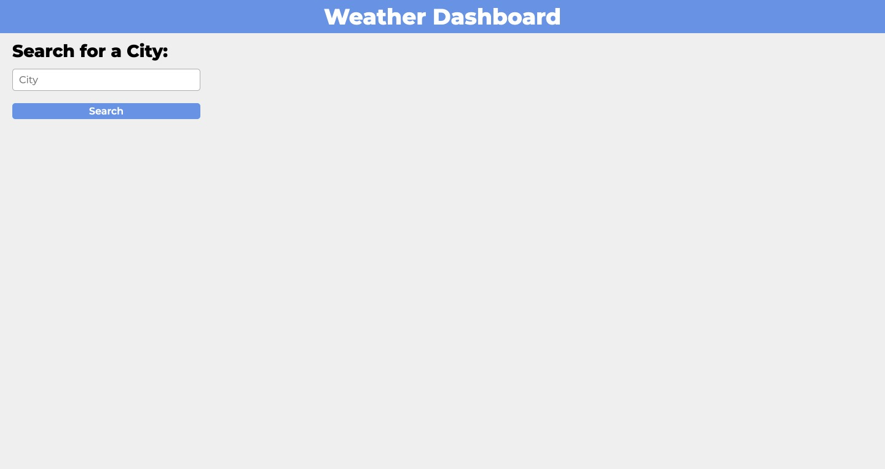
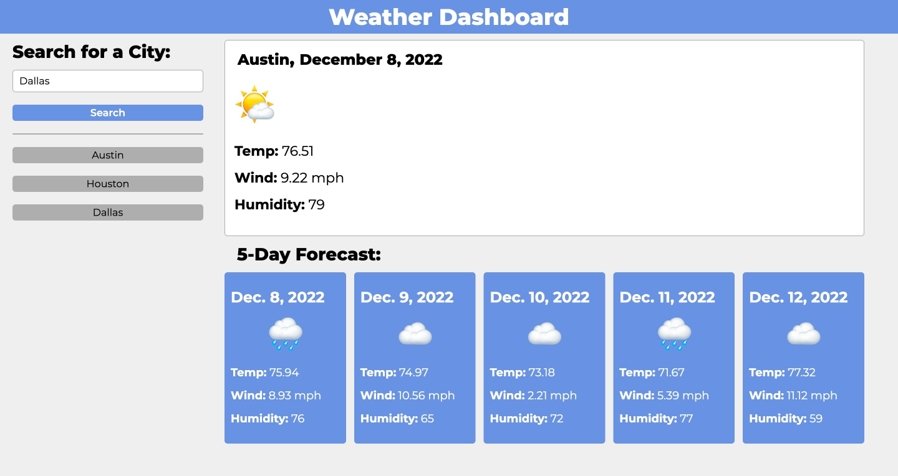
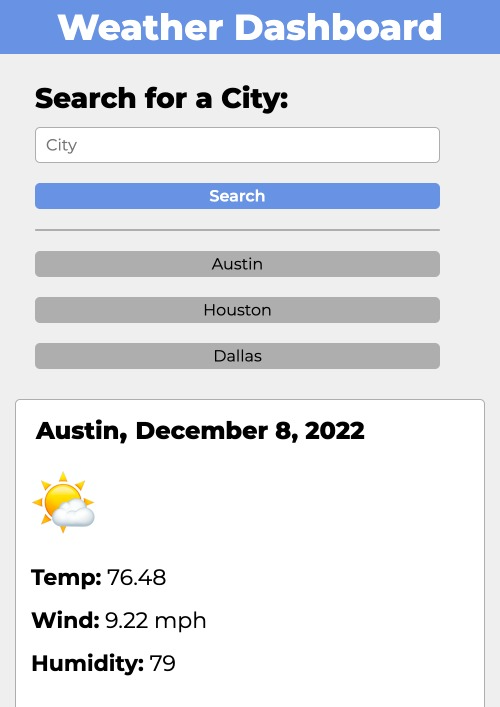

# Server-Side-API-Weather-Dashboard
A weather dashboard that will run in the browser and feature dynamically updated HTML and CSS using JavaScript and server-side APIs

## Links
[**Week Six Challenge**](https://mbartnett.github.io/Server-Side-API-Weather-Dashboard/) 
[**Week Six Challenge Repo**](https://github.com/mbartnett/Server-Side-API-Weather-Dashboard)

## Screengrab

## License

Please refer to the LICENSE in the repo.